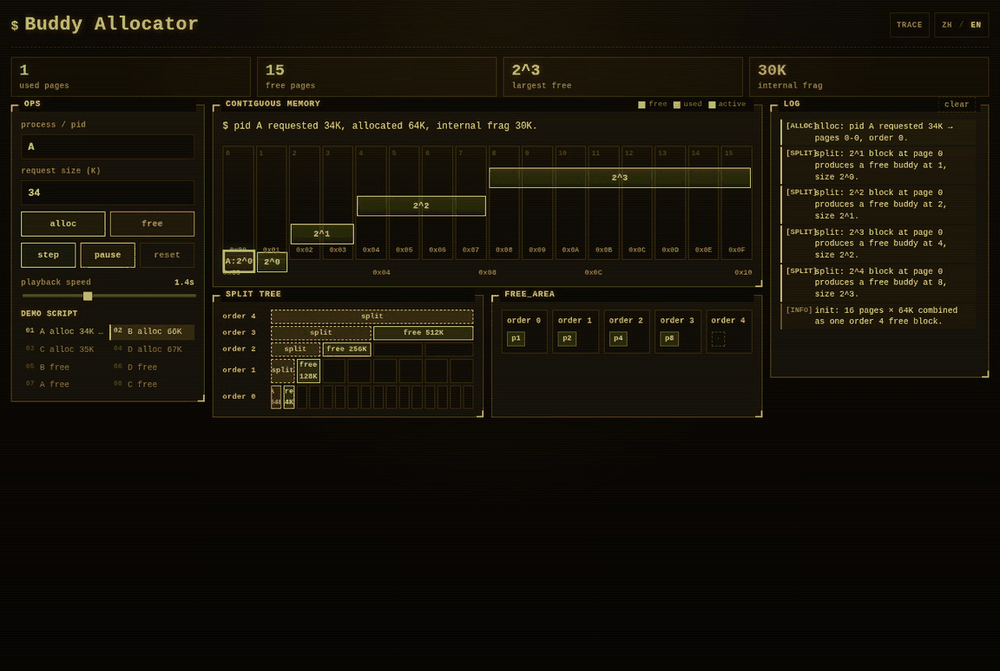

# Simple Buddy Allocator

Browser-based buddy memory allocation visualizer, with the original C reference implementation kept in the repository.

**Live demo:** https://weida.github.io/simplebuddy/



## Highlights

- Visualizes allocation, splitting, freeing, and coalescing
- Shows contiguous memory, split tree, and `free_area` lists by order
- Supports step-by-step execution, autoplay, and playback speed control
- Displays allocated capacity, internal fragmentation, and the buddy formula
- Pure static HTML, CSS, and JavaScript; no build step required

## Project Layout

```text
simplebuddy/
├── README.md
├── .gitignore
├── index.html              # GitHub Pages root entry, redirects to web/
├── assets/
│   └── simplebuddy-demo.gif
├── c/                      # C reference implementation
│   ├── buddy.c
│   ├── buddy.h
│   ├── buddytest.c
│   ├── list.h
│   └── Makefile
└── web/                    # Browser visualizer
    ├── index.html
    ├── styles.css
    └── app.js
```

The `c/` and `web/` directories are independent.

## Algorithm In 60 Seconds

- Memory is divided into fixed-size pages. This demo uses `16` pages, `64K` each
- Each order has a free list: `free_area[order]`
- A block at order `i` contains `2^i` pages
- Allocation rounds the request up to the smallest power-of-two block
- If the target order is empty, a larger block is split repeatedly
- Freeing uses `buddy = pfn XOR 2^order` to locate the buddy block
- Coalescing happens only when the buddy is free and has the same order
- Internal fragmentation = allocated capacity - requested capacity

## Run The C Version

```bash
cd c
make
./buddytest
```

Note: the original C code intentionally keeps its older style. Newer GCC versions may fail on implicit function declarations. If compatibility is needed, make that a focused C-only change.

## License

MIT License. See [LICENSE](LICENSE) for details.
