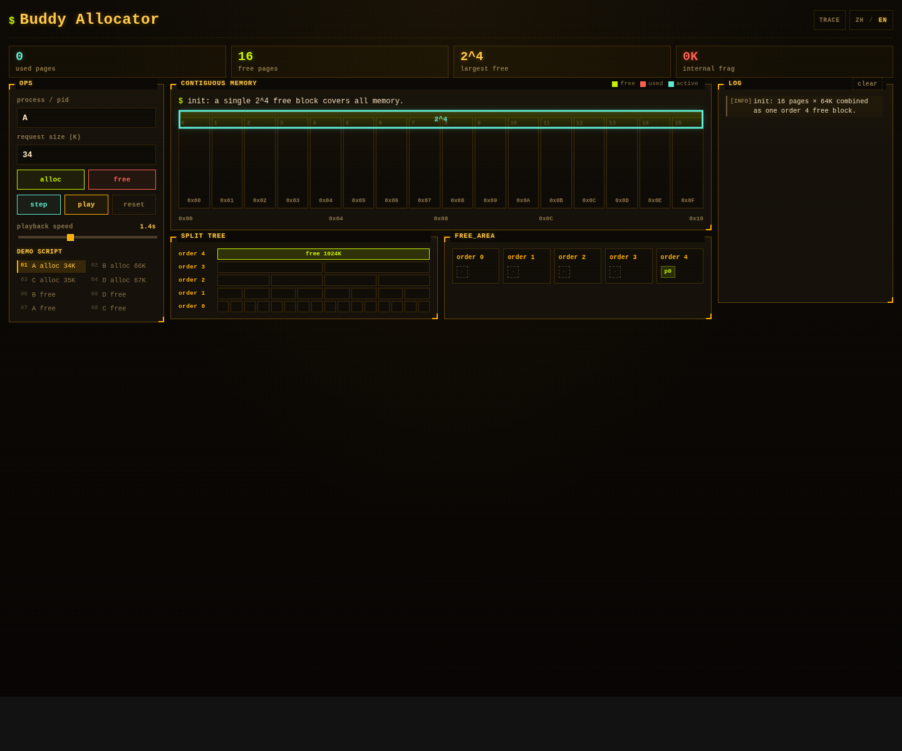

# Simple Buddy Allocator

[中文](#中文) | [English](#english)

Browser-based buddy memory allocation visualizer, with the original C reference implementation kept in the repository.

**Live demo:** https://weida.github.io/simplebuddy/




<a id="中文"></a>
<details open>
<summary><strong>中文</strong></summary>

Simple Buddy Allocator 是一个用于演示 Buddy 内存分配算法的小项目。仓库同时保留原始 C 版本和可通过浏览器访问的交互式演示版本。

### 功能亮点

- 动态演示 Buddy allocator 的申请、拆分、释放和合并过程
- 展示连续内存布局、split tree、`free_area` 各 order 链表
- 支持单步执行、自动播放和播放速度调节
- 展示实际分配容量、内部碎片和 buddy 合并公式
- 支持中文 / English 页面切换
- 纯静态 Web 页面，无构建步骤、无前端依赖

### 目录结构

```text
simplebuddy/
├── README.md
├── .gitignore
├── index.html              # GitHub Pages 根入口，跳转到 web/
├── assets/
│   └── simplebuddy-web-2026-04-26.png
├── c/                      # C 参考实现
│   ├── buddy.c
│   ├── buddy.h
│   ├── buddytest.c
│   ├── list.h
│   └── Makefile
└── web/                    # 浏览器演示
    ├── index.html
    ├── styles.css
    └── app.js
```

`c/` 和 `web/` 互不依赖，可以独立查看和运行。

### 算法 60 秒概要

- 内存被切成固定大小页。本演示使用 `16` 页，每页 `64K`
- 每个 order 维护一个空闲链表：`free_area[order]`
- order `i` 的块大小是 `2^i` 个页
- 申请内存时，把请求大小向上取到最小的 power-of-two 块
- 如果目标 order 没有空闲块，就从更大的 order 拿一块并不断二分
- 释放内存时，通过 `buddy = pfn XOR 2^order` 找到 buddy
- 只有 buddy 同 order 且空闲时才能合并，合并后继续向上检查
- 内部碎片 = 实际分配容量 - 用户请求容量

### 运行 C 版本

```bash
cd c
make
./buddytest
```

说明：原 C 代码保留了较早期的 C 写法。在较新的 GCC 环境下，可能会因为隐式函数声明等问题编译失败。若需要修复，建议单独提交 C 兼容性改动，不要和 Web 演示改动混在一起。

### 本地运行 Web 演示

Web 版本是纯静态页面。推荐用本地静态服务打开：

```bash
python3 -m http.server 8000
```

然后访问：

```text
http://localhost:8000/web/
```

也可以直接打开：

```text
web/index.html
```

### 发布 GitHub Pages

线上页面来自 `gh-pages` 分支。修改 `web/` 后，先提交到主分支：

```bash
git add web/index.html web/styles.css web/app.js
git commit -m "Update web demo"
git push origin master
```

再把 `web/` 子目录同步到 `gh-pages`：

```bash
COMMIT=$(git subtree split --prefix web)
git push origin $COMMIT:gh-pages
```

GitHub Pages 可能有缓存，发布后等待 1-3 分钟或强制刷新浏览器。

### 演示 GIF

顶部 GIF 展示了点击 `play` 后的自动播放流程。

如需重新录制，建议覆盖：

1. 自动播放完整 8 步流程
2. 中文 / English 切换
3. 手动申请后再执行脚本的状态处理
4. 展开解说区域查看公式
5. 移动端宽度下的响应式效果

### 后续可优化方向

- 修复 C 版本在新 GCC 下的编译兼容性
- 把拆分和合并过程拆成更细的逐帧动画
- 增加“为什么不能合并”的解释
- 让 C 输出和 Web 日志更严格对齐
- 支持自定义页大小、页数和最大 order

</details>

<a id="english"></a>
<details>
<summary><strong>English</strong></summary>

Simple Buddy Allocator is a small project for demonstrating the buddy memory allocation algorithm. It keeps the original C reference implementation and adds a browser-based interactive visualizer.

### Highlights

- Visualizes allocation, splitting, freeing, and coalescing
- Shows contiguous memory, split tree, and `free_area` lists by order
- Supports step-by-step execution, autoplay, and playback speed control
- Displays allocated capacity, internal fragmentation, and the buddy formula
- Supports Chinese / English switching in the web demo
- Pure static HTML, CSS, and JavaScript; no build step required

### Project Layout

```text
simplebuddy/
├── README.md
├── .gitignore
├── index.html              # GitHub Pages root entry, redirects to web/
├── assets/
│   └── simplebuddy-web-2026-04-26.png
├── c/                      # C reference implementation
│   ├── buddy.c
│   ├── buddy.h
│   ├── buddytest.c
│   ├── list.h
│   └── Makefile
└── web/                    # Browser visualizer
    ├── index.html
    ├── styles.css
    └── app.js
```

The `c/` and `web/` directories are independent.

### Algorithm In 60 Seconds

- Memory is divided into fixed-size pages. This demo uses `16` pages, `64K` each
- Each order has a free list: `free_area[order]`
- A block at order `i` contains `2^i` pages
- Allocation rounds the request up to the smallest power-of-two block
- If the target order is empty, a larger block is split repeatedly
- Freeing uses `buddy = pfn XOR 2^order` to locate the buddy block
- Coalescing happens only when the buddy is free and has the same order
- Internal fragmentation = allocated capacity - requested capacity

### Run The C Version

```bash
cd c
make
./buddytest
```

Note: the original C code intentionally keeps its older style. Newer GCC versions may fail on implicit function declarations. If compatibility is needed, make that a focused C-only change.

### Run The Web Demo Locally

The Web demo is fully static. A local static server is recommended:

```bash
python3 -m http.server 8000
```

Then open:

```text
http://localhost:8000/web/
```

You can also open `web/index.html` directly in a browser.

### Publish To GitHub Pages

The live site is served from the `gh-pages` branch. After changing `web/`, commit to the main branch first:

```bash
git add web/index.html web/styles.css web/app.js
git commit -m "Update web demo"
git push origin master
```

Then publish the `web/` subtree to `gh-pages`:

```bash
COMMIT=$(git subtree split --prefix web)
git push origin $COMMIT:gh-pages
```

GitHub Pages may cache the old version for a few minutes.

### Demo GIF

The GIF at the top shows the autoplay flow after clicking `play`.

If the GIF needs to be regenerated, cover these scenarios:

1. Autoplay the full 8-step script
2. Switch between Chinese and English
3. Try manual allocation, then resume scripted playback
4. Expand the explanation section and show formulas
5. Test responsive layout below 760px width

### Future Improvements

- Fix C compatibility with newer GCC versions
- Animate splitting and coalescing at a finer frame level
- Explain why certain blocks cannot be merged
- Align C output and Web logs more strictly
- Allow custom page size, page count, and max order

</details>
